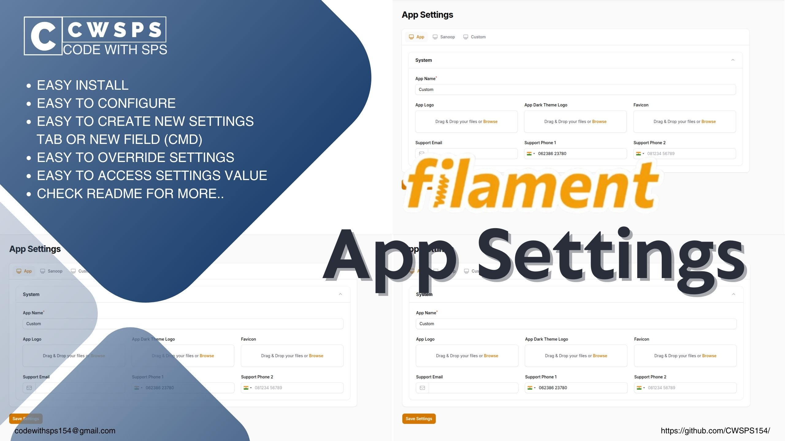
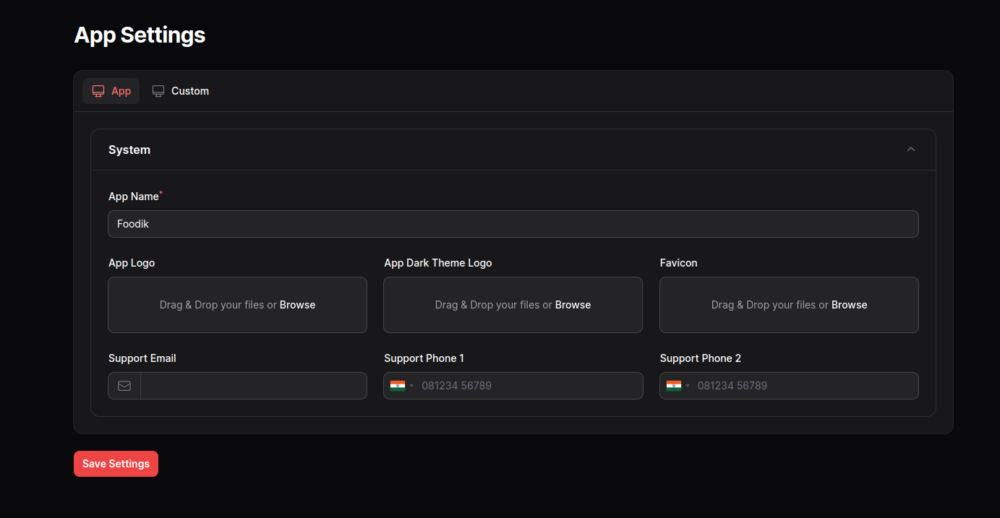

# Filament App Settings



This package will help you to build settings panel with custom forms, which supports all Filament forms components.
## Installation

Install Using Composer

```shell
composer require cwsps154/app-settings
```
Run

```shell
php artisan app-settings:install
```

## Usage/Examples

Add this into your Filament `PannelProvider` class `panel()`
```php
$panel->plugins([AppSettingsPlugin::make()]);
```

You will get some customization on this
```php
AppSettingsPlugin::make()
    ->canAccess(function () {
        return true;
    })
    ->canAccessAppSectionTab(function () {
        return true;
    })
    ->appAdditionalField([])
```
Here using `canAccess()` method you can prevent the view and edit access to the page and using `appAdditionalField()` method you can add additional sections to the default app tab which will available after you install this plugin.
Also, you can restrict access to the app section using `canAccessAppSectionTab()`

If you are using `cwsps154/filament-users-roles-permissions` plugin you can use like this

```php
use CWSPS154\UsersRolesPermissions\UsersRolesPermissionsServiceProvider;
use CWSPS154\AppSettings\Models\AppSettings;

AppSettingsPlugin::make()
    ->canAccess(
        UsersRolesPermissionsServiceProvider::HAVE_ACCESS_GATE,
        AppSettings::VIEW_EDIT_SETTINGS
    )->canAccessAppSectionTab(
        UsersRolesPermissionsServiceProvider::HAVE_ACCESS_GATE,
        AppSettings::APP_SECTION_SETTINGS
    ),
```

Run this command to set up the plugin

```shell
php artisan users-roles-permissions:install
php artisan filament:assets
```

```shell
php artisan vendor:publish --tag=app-settings-config
```

which contains these settings

```php
return [
    'settings-page' => \CWSPS154\FilamentAppSettings\Page\AppSettings::class
];
```

You can create a new tab to these settings using `php artisan make:app-settings-tab` command, which will create a class inside `app/Filament/Settings/Forms` folder.

Sometimes the newly created tab will not automatically show in the page, then please run this
```shell
composer dumpautoload
```

```php
<?php

namespace App\Filament\Settings\Forms;

use Filament\Forms\Components\Tabs\Tab;

class Custom
{
    /**
     * @return Tab
     */
    public static function getTab(): Tab
    {
        return Tab::make('custom')
                    ->label(__('Custom'))
                    ->icon('heroicon-o-computer-desktop')
                    ->schema(self::getFields())
                    ->columns()
                    ->statePath('custom')
                    ->visible(true);
    }

    public static function getFields(): array
    {
        return [];
    }

    public static function getSortOrder(): int
    {
        return 10;
    }
}
```

You can customize the tab sections using the `getTab()`. Please note that you should give a unique name to the tab, statePath. Because, we are using custom helper function `get_settings()` to fetch the settings data. So the these names should be unique.

Using `visible(true)` you can individually control each tab.

`get_settings()` accept the 'tab_name.field_name'.

Example : `get_settings('app.app_logo'))`. This will support nested fields like `Repeater`, these values you can access by dot.

`getFields()` returns the array of Filament forms component. You can use all available forms component here.

`getSortOrder()` returns the integer value, using this to sort the tabs in the page.

## Screenshots




## Thanks

Actually this package I was build after using one already existing Filament plugin which is called Filament General Settings. I found some limitations to that packages, So I created this one.
Thanks
